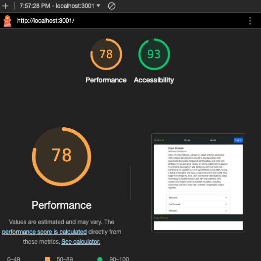

# lift-tracker

## Version 1.1.0

## Team Members

* Drew Stroede

## Project Overview

This web application serves as a lift tracker, enabling users to record and revisit their daily workouts to track progress effectively. By providing a user-friendly interface with intuitive tracking features, the app aims to simplify the process of monitoring progress and optimizing workouts.  Developed using HTML, CSS, JavaScript, React, Mongoose, and Auth0, the app allows users to name workouts, add exercises, sets, reps, weights, and easily update new weight levels.

## Problem Domain

Casual gym-goers face challenges in implementing effective periodization into their weightlifting routines due to the absence of accessible tools. Tracking progress and optimizing workouts become cumbersome, hindering individuals from achieving sustained results. A user-friendly app tailored to the needs of recreational lifters is needed to streamline periodization, providing intuitive tracking and personalized guidance for a more effective and enjoyable fitness experience.

### Data Modeling

#### 

### WireFrame

#### 

### Lighthouse Accessibilty Score

#### 

### Credits
Code Fellows, JB Tellez, Tammy Do, Brook Riggio, ChatGPT